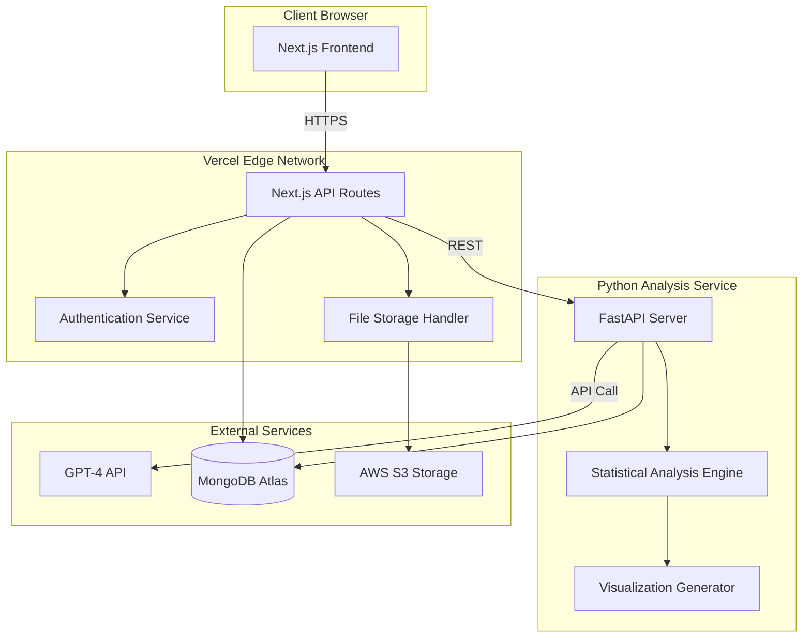

# Design Document

## Overview

DataStory AI is an AI-native data storytelling platform built with a modern, scalable architecture. The system consists of three primary layers:

1. **Frontend Layer**: Next.js 15 application with TypeScript and TailwindCSS providing the user interface
2. **Backend Layer**: Node.js API routes handling authentication, data management, and orchestration
3. **Analysis Layer**: Python FastAPI microservice performing statistical analysis and coordinating AI narrative generation

The platform follows a serverless-first architecture deployed on Vercel (frontend/backend) and cloud infrastructure (Python microservice), enabling rapid scaling and cost-effective operations during the MVP phase.

### Key Design Principles

- **Automation First**: Minimize user configuration; maximize intelligent defaults
- **Progressive Enhancement**: Core functionality works immediately; advanced features enhance experience
- **Fail Gracefully**: Provide partial results when possible; clear error messages when not
- **Performance Budget**: 3-second initial load, 60-second end-to-end story generation
- **Security by Default**: Encrypt everything; validate all inputs; isolate user data

## Architecture

### High-Level System Architecture




### Request Flow for Story Generation

1. User uploads CSV/Excel file via drag-and-drop interface
2. Frontend validates file size and format, displays upload progress
3. File sent to Next.js API route `/api/upload`
4. API route authenticates user, checks tier limits, uploads file to S3
5. API route creates job record in MongoDB with status "processing"
6. API route calls Python FastAPI endpoint `/analyze` with S3 file reference
7. FastAPI downloads file from S3, performs data type detection and preprocessing
8. Statistical analysis engine calculates trends, correlations, distributions
9. FastAPI calls GPT-4 API with structured prompt containing statistical results
10. GPT-4 generates three narrative sections (summary, findings, recommendations)
11. Visualization generator selects 3-4 appropriate chart types based on data characteristics
12. FastAPI returns complete story payload (narratives + chart configs) to API route
13. API route saves story to MongoDB, updates job status to "completed"
14. Frontend polls job status, retrieves completed story, renders scrollytelling interface

### Technology Stack Rationale

**Frontend: Next.js 15 + TypeScript + TailwindCSS**
- Next.js 15 provides React Server Components for optimal performance
- TypeScript ensures type safety across large codebase
- TailwindCSS enables rapid UI development with consistent design system
- Built-in API routes eliminate need for separate backend server

**Backend: Node.js API Routes + MongoDB Atlas**
- API routes co-located with frontend reduce deployment complexity
- MongoDB flexible schema accommodates evolving story structure
- Atlas managed service eliminates database operations overhead
- Native JSON storage aligns with JavaScript ecosystem

**Analysis Service: Python FastAPI + pandas + scikit-learn**
- Python ecosystem dominates data science with mature libraries
- pandas provides efficient data manipulation for datasets up to 1M rows
- scikit-learn offers production-ready statistical algorithms
- FastAPI delivers high-performance async API with automatic OpenAPI docs

**AI: OpenAI GPT-4 API**
- GPT-4 provides superior narrative quality vs GPT-3.5
- API model eliminates infrastructure management
- Pay-per-use pricing aligns with MVP economics
- Structured prompts ensure consistent output format

## Components and Interfaces

### Frontend Components

#### 1. Authentication Components

**LoginForm Component**
- Input fields: email (validated), password (masked)
- Submit button with loading state
- Link to password reset flow
- Error message display area
- "Remember me" checkbox for extended sessions

**RegisterForm Component**
- Input fields: email, password, confirm password
- Real-time password strength indicator
- Terms of service acceptance checkbox
- Submit button with loading state
- Validation error display

**PasswordReset Component**
- Email input for reset request
- Success/error message display
- Resend link functionality with cooldown timer

#### 2. Dashboard Components

**DashboardLayout Component**
- Top navigation bar with user menu
- Sidebar with navigation links (Dashboard, Stories, Settings)
- Main content area with responsive grid
- Usage indicator showing remaining stories for free tier

**StoryCard Component**
- Story thumbnail preview (first chart)
- Story title and creation date
- Action buttons: View, Export PDF, Delete
- Hover state with quick stats (charts count, dataset rows)

**UploadZone Component**
- Drag-and-drop area with visual feedback
- File type indicator (CSV, Excel accepted)
- File size limit display (1000 rows for free tier)
- Browse button as alternative to drag-and-drop
- Upload progress bar with percentage

#### 3. Story Generation Components

**ProcessingStatus Component**
- Multi-stage progress indicator
- Current stage display: Uploading → Analyzing → Generating Narrative → Creating Visualizations
- Estimated time remaining
- Cancel button (aborts processing, cleans up resources)
- Error state with retry option

**StoryViewer Component**
- Scrollytelling container with scroll-snap behavior
- Narrative sections with typography hierarchy
- Chart components with fade-in animations
- Scroll progress indicator
- Export and share action buttons
- "Powered by DataStory AI" badge for free tier

#### 4. Chart Components

**LineChart Component**
- D3.js-based time series visualization
- Responsive SVG with viewBox scaling
- Axis labels with automatic formatting
- Tooltip on hover showing exact values
- Legend for multiple series
- Smooth animation on initial render

**BarChart Component**
- Horizontal or vertical orientation based on data
- Color-coded bars with consistent palette
- Value labels on bars
- Axis with grid lines
- Responsive width adjustment

**ScatterPlot Component**
- Two-axis numeric visualization
- Trend line overlay when correlation significant
- Point hover showing data labels
- Zoom and pan interactions (optional for MVP)
- Color encoding for categorical third dimension

**PieChart Component**
- Percentage-based circular visualization
- Slice labels with percentages
- Legend with category names
- Hover effect highlighting slices
- Minimum slice size threshold (5%) to avoid clutter

### Backend API Endpoints

#### Authentication Endpoints

**POST /api/auth/register**

```typescript
Request: { email: string, password: string }
Response: { userId: string, token: string, tier: 'free' | 'professional' }
Validation: Email format, password complexity (8+ chars, mixed case, number)
Side Effects: Creates user in MongoDB, sends welcome email
```

**POST /api/auth/login**
```typescript
Request: { email: string, password: string, rememberMe?: boolean }
Response: { userId: string, token: string, tier: string, storiesRemaining: number }
Validation: Credentials match, account not locked
Side Effects: Creates session, updates last login timestamp
```

**POST /api/auth/reset-password**
```typescript
Request: { email: string }
Response: { success: boolean, message: string }
Side Effects: Generates reset token, sends email with reset link
```

**POST /api/auth/logout**
```typescript
Request: { token: string }
Response: { success: boolean }
Side Effects: Invalidates session token
```

#### Story Management Endpoints

**POST /api/upload**
```typescript
Request: FormData with file, userId from auth token
Response: { jobId: string, status: 'processing' }
Validation: File type (CSV/Excel), size limit, user tier limits
Side Effects: Uploads to S3, creates job record, triggers analysis service
```

**GET /api/jobs/:jobId**
```typescript
Response: { 
  jobId: string, 
  status: 'processing' | 'completed' | 'failed',
  progress: number,
  currentStage: string,
  storyId?: string,
  error?: string
}
Authorization: User owns job
```

**GET /api/stories**
```typescript
Response: { 
  stories: Array<{
    storyId: string,
    title: string,
    createdAt: Date,
    thumbnail: string,
    datasetRows: number,
    chartsCount: number
  }>
}
Authorization: User's own stories only
Pagination: Limit 20 per page
```

**GET /api/stories/:storyId**
```typescript
Response: {
  storyId: string,
  title: string,
  createdAt: Date,
  narratives: {
    summary: string,
    keyFindings: string,
    recommendations: string
  },
  charts: Array<ChartConfig>,
  metadata: {
    datasetRows: number,
    columnsAnalyzed: number,
    processingTime: number
  }
}
Authorization: User owns story
```

**DELETE /api/stories/:storyId**
```typescript
Response: { success: boolean }
Authorization: User owns story
Side Effects: Deletes story from MongoDB, removes S3 files, updates usage count
```

**POST /api/stories/:storyId/export**
```typescript
Response: PDF file stream
Authorization: User owns story
Side Effects: Generates PDF, logs export event
```

### Python Analysis Service API

**POST /analyze**
```typescript
Request: {
  fileUrl: string,  // S3 presigned URL
  userId: string,
  jobId: string,
  options?: {
    audienceLevel?: 'executive' | 'technical' | 'general'
  }
}
Response: {
  narratives: {
    summary: string,
    keyFindings: string,
    recommendations: string
  },
  charts: Array<{
    type: 'line' | 'bar' | 'scatter' | 'pie',
    title: string,
    data: any,
    config: ChartConfig
  }>,
  statistics: {
    trends: Array<TrendAnalysis>,
    correlations: Array<CorrelationResult>,
    distributions: Array<DistributionStats>
  }
}
```

### Analysis Service Internal Components

**DataPreprocessor**
- Reads CSV/Excel files using pandas
- Detects data types (numeric, categorical, datetime, text)
- Handles missing values (mean imputation for numeric, mode for categorical)
- Validates minimum data requirements (2 columns, 10 rows)
- Returns cleaned DataFrame with metadata

**StatisticalAnalyzer**
- TrendDetector: Identifies temporal patterns using linear regression
- CorrelationCalculator: Computes Pearson correlation matrix, filters |r| > 0.5
- DistributionAnalyzer: Calculates mean, median, std dev, skewness, kurtosis
- OutlierDetector: Uses IQR method to identify anomalies
- FrequencyAnalyzer: Computes value counts for categorical columns

**NarrativeGenerator**
- Constructs structured prompt for GPT-4 with statistical results
- Prompt template includes: dataset overview, key statistics, analysis results
- Specifies output format: three sections with word count targets
- Implements retry logic with exponential backoff (3 attempts)
- Validates generated text against source statistics
- Returns structured narrative object

**VisualizationSelector**
- Rule-based chart type selection algorithm
- Decision tree: datetime column → line chart, categorical comparison → bar chart
- Correlation threshold (|r| > 0.6) → scatter plot with trend line
- Proportional data (3-7 categories) → pie chart
- Selects 3-4 most informative visualizations
- Generates chart configuration objects with data and styling

## Data Models

### User Model

```typescript
interface User {
  _id: ObjectId;
  email: string;                    // Unique, indexed
  passwordHash: string;              // bcrypt hashed
  tier: 'free' | 'professional' | 'business' | 'enterprise';
  createdAt: Date;
  lastLoginAt: Date;
  
  // Usage tracking
  storiesThisMonth: number;          // Reset on 1st of month
  monthlyResetDate: Date;
  totalStoriesCreated: number;
  
  // Settings
  preferences: {
    defaultAudienceLevel: 'executive' | 'technical' | 'general';
    emailNotifications: boolean;
  };
  
  // Tier limits (denormalized for performance)
  limits: {
    storiesPerMonth: number;         // 3 for free, unlimited for paid
    maxDatasetRows: number;          // 1000 for free, 50k for pro, etc.
    teamMembers: number;
  };
}
```

### Story Model

```typescript
interface Story {
  _id: ObjectId;
  userId: ObjectId;                  // Foreign key to User, indexed
  title: string;                     // Auto-generated or user-provided
  createdAt: Date;
  updatedAt: Date;
  
  // Source data reference
  dataset: {
    originalFilename: string;
    s3Key: string;                   // S3 object key
    rowCount: number;
    columnCount: number;
    fileSize: number;                // Bytes
  };
  
  // Generated content
  narratives: {
    summary: string;
    keyFindings: string;
    recommendations: string;
  };
  
  charts: Array<{
    chartId: string;
    type: 'line' | 'bar' | 'scatter' | 'pie';
    title: string;
    data: any;                       // Chart-specific data structure
    config: {
      xAxis?: string;
      yAxis?: string;
      colors?: string[];
      legend?: boolean;
    };
  }>;
  
  // Metadata
  statistics: {
    trends: Array<{
      column: string;
      direction: 'increasing' | 'decreasing' | 'stable';
      slope: number;
      rSquared: number;
    }>;
    correlations: Array<{
      column1: string;
      column2: string;
      coefficient: number;
      significance: 'strong' | 'moderate' | 'weak';
    }>;
    distributions: Array<{
      column: string;
      mean: number;
      median: number;
      stdDev: number;
      outliers: number;
    }>;
  };
  
  // Processing info
  processingTime: number;            // Milliseconds
  aiModel: string;                   // e.g., "gpt-4-turbo-preview"
  
  // Access control
  visibility: 'private' | 'public';
  shareToken?: string;               // For public sharing
}
```

### Job Model

```typescript
interface Job {
  _id: ObjectId;
  jobId: string;                     // UUID, indexed
  userId: ObjectId;
  status: 'queued' | 'processing' | 'completed' | 'failed';
  createdAt: Date;
  updatedAt: Date;
  
  // Progress tracking
  currentStage: 'uploading' | 'analyzing' | 'generating_narrative' | 'creating_visualizations';
  progress: number;                  // 0-100
  
  // Input
  fileUrl: string;                   // S3 presigned URL
  options: {
    audienceLevel?: string;
  };
  
  // Output
  storyId?: ObjectId;                // Set when completed
  error?: {
    code: string;
    message: string;
    timestamp: Date;
  };
  
  // Retry tracking
  attempts: number;
  maxAttempts: number;               // Default 3
}
```

### Session Model

```typescript
interface Session {
  _id: ObjectId;
  userId: ObjectId;                  // Indexed
  token: string;                     // JWT or UUID, indexed
  createdAt: Date;
  expiresAt: Date;
  lastActivityAt: Date;
  
  // Session metadata
  userAgent: string;
  ipAddress: string;
  rememberMe: boolean;
}
```

## Error Handling

### Error Categories and Strategies

**1. User Input Errors (4xx)**
- Invalid file format: Return clear message "Please upload CSV or Excel files only"
- File too large: Return message with tier limit "Free tier supports up to 1,000 rows. Upgrade to Professional for 50,000 rows"
- Insufficient data: "Dataset must contain at least 2 columns and 10 rows"
- Rate limit exceeded: "You've reached your monthly limit of 3 stories. Upgrade or wait until [reset date]"

**2. Processing Errors (5xx)**
- Data parsing failure: Retry once, then return "Unable to parse file. Please check format and try again"
- Statistical analysis error: Log detailed error, return "Analysis failed. Our team has been notified"
- GPT-4 API timeout: Retry 3 times with exponential backoff (1s, 2s, 4s), then fail gracefully
- Visualization generation error: Return partial results with message "Some visualizations could not be generated"

**3. Infrastructure Errors**
- S3 upload failure: Retry 3 times, then return "Upload failed. Please check your connection and try again"
- MongoDB connection loss: Implement connection pooling with auto-reconnect
- Python service unavailable: Queue job for retry, notify user "Processing delayed. We'll email you when ready"

### Error Response Format

```typescript
interface ErrorResponse {
  error: {
    code: string;              // Machine-readable error code
    message: string;           // User-friendly message
    details?: any;             // Additional context for debugging
    retryable: boolean;        // Whether user should retry
    supportId?: string;        // Reference for support tickets
  };
}
```

### Logging Strategy

- **Frontend**: Log user actions (page views, button clicks, errors) to analytics service
- **Backend API**: Log all requests with userId, endpoint, status code, response time
- **Python Service**: Log analysis steps, GPT-4 prompts/responses, processing times
- **Error Logs**: Centralized logging to CloudWatch/Datadog with severity levels
- **Sensitive Data**: Never log passwords, tokens, or raw dataset contents

## Testing Strategy

### Unit Testing

**Frontend Components (Jest + React Testing Library)**
- Test each component in isolation with mocked props
- Verify rendering with different states (loading, error, success)
- Test user interactions (clicks, form submissions)
- Coverage target: 70% for MVP

**Backend API Routes (Jest + Supertest)**
- Test each endpoint with valid and invalid inputs
- Mock external services (S3, MongoDB, Python service)
- Verify authentication and authorization logic
- Test error handling and edge cases
- Coverage target: 80% for critical paths

**Python Analysis Service (pytest)**
- Test data preprocessing with various file formats
- Verify statistical calculations with known datasets
- Test chart selection logic with different data characteristics
- Mock GPT-4 API responses
- Coverage target: 85% for analysis algorithms

### Integration Testing

**End-to-End Story Generation Flow**
- Upload sample CSV → verify S3 storage
- Trigger analysis → verify Python service receives request
- Mock GPT-4 response → verify narrative parsing
- Verify story saved to MongoDB
- Verify frontend displays completed story

**Authentication Flow**
- Register new user → verify email sent
- Login → verify session created
- Access protected endpoint → verify authorization
- Logout → verify session invalidated

**Tier Limit Enforcement**
- Free user creates 3 stories → verify 4th blocked
- Free user uploads 1001 rows → verify rejection
- Month rollover → verify counter reset

### Manual Testing Checklist

- [ ] Upload CSV with various data types (numeric, categorical, datetime)
- [ ] Upload Excel with multiple sheets (use first sheet)
- [ ] Upload file with missing values (verify imputation)
- [ ] Upload file exceeding row limit (verify error)
- [ ] Generate story and verify all 3 narrative sections present
- [ ] Verify 3-4 charts generated and appropriate for data
- [ ] Test scrollytelling animations on desktop and mobile
- [ ] Export PDF and verify formatting
- [ ] Delete story and verify removal from dashboard
- [ ] Test on Chrome, Firefox, Safari, Edge
- [ ] Test responsive design on mobile (375px), tablet (768px), desktop (1920px)

### Performance Testing

**Load Testing (Artillery or k6)**
- Simulate 100 concurrent users uploading files
- Target: 95% of requests complete within 60 seconds
- Monitor: API response times, Python service CPU/memory, database connections

**Stress Testing**
- Gradually increase load until system degrades
- Identify bottlenecks (likely GPT-4 API rate limits or Python service CPU)
- Establish maximum concurrent story generations (target: 50)

**Dataset Size Testing**
- Test with datasets: 100, 500, 1000, 5000, 10000 rows
- Verify processing time scales linearly
- Identify optimal chunking strategy for large datasets

## Deployment Architecture

### Vercel Deployment (Frontend + API Routes)

**Configuration**
- Framework: Next.js 15
- Node version: 20.x
- Build command: `npm run build`
- Output directory: `.next`
- Environment variables: `DATABASE_URL`, `S3_BUCKET`, `OPENAI_API_KEY`, `PYTHON_SERVICE_URL`

**Edge Functions**
- API routes deployed as serverless functions
- Cold start optimization: Keep functions warm with scheduled pings
- Timeout: 60 seconds (Vercel Pro plan)
- Memory: 1024 MB

### Python Service Deployment (AWS ECS Fargate)

**Container Configuration**
- Base image: `python:3.11-slim`
- Dependencies: pandas, scikit-learn, statsmodels, fastapi, uvicorn
- Health check: `/health` endpoint
- Auto-scaling: 1-5 instances based on CPU (target 70%)

**Resource Allocation**
- CPU: 1 vCPU
- Memory: 2 GB
- Concurrent requests: 10 per instance

### MongoDB Atlas

**Cluster Configuration**
- Tier: M10 (Dedicated, 2GB RAM) for production
- Region: Same as primary users (e.g., Mumbai for India)
- Backup: Continuous with 7-day retention
- Indexes: userId, jobId, email (unique)

### AWS S3

**Bucket Configuration**
- Bucket name: `datastory-ai-uploads-prod`
- Region: Same as MongoDB
- Encryption: AES-256 server-side
- Lifecycle policy: Delete files after 30 days
- CORS: Allow Vercel domain

### CI/CD Pipeline

**GitHub Actions Workflow**
1. On push to `main` branch
2. Run linting (ESLint, Prettier)
3. Run unit tests (Jest, pytest)
4. Build Next.js application
5. Build Python Docker image
6. Deploy to Vercel (automatic)
7. Push Docker image to ECR
8. Update ECS service with new image
9. Run smoke tests against production
10. Notify team on Slack

## Security Considerations

**Authentication**
- Password hashing: bcrypt with 12 rounds
- Session tokens: JWT with 7-day expiration (30 days if "remember me")
- Token storage: httpOnly cookies to prevent XSS

**Authorization**
- Verify userId from token matches resource owner
- Implement role-based access control (RBAC) for future team features
- Rate limiting: 100 requests/hour per user, 1000/hour per IP

**Data Protection**
- TLS 1.3 for all connections
- S3 presigned URLs with 1-hour expiration
- Database encryption at rest (MongoDB Atlas default)
- Never log sensitive data (passwords, tokens, dataset contents)

**Input Validation**
- Sanitize all user inputs to prevent injection attacks
- Validate file types using magic numbers, not just extensions
- Limit file upload size: 10 MB for MVP
- Validate email format with regex
- Enforce password complexity requirements

**API Security**
- CORS: Whitelist only Vercel domain
- CSRF protection: SameSite cookies
- Content Security Policy headers
- Helmet.js for security headers

## Monitoring and Observability

**Application Metrics**
- Request rate, error rate, latency (p50, p95, p99)
- Story generation success rate
- GPT-4 API call success rate and latency
- Database query performance

**Business Metrics**
- Daily/monthly active users
- Stories created per day
- Freemium to paid conversion rate
- Average processing time per story

**Alerting**
- Error rate > 5% for 5 minutes
- API latency p95 > 5 seconds
- Python service CPU > 90% for 10 minutes
- GPT-4 API failure rate > 10%

**Tools**
- Vercel Analytics for frontend performance
- CloudWatch for AWS resources
- MongoDB Atlas monitoring for database
- Sentry for error tracking
- PostHog or Mixpanel for product analytics

This design provides a solid foundation for the DataStory AI MVP, balancing rapid development with scalability and maintainability. The architecture supports the 12-16 week development timeline while positioning the platform for future enhancements in Phase 2 and Phase 3.
