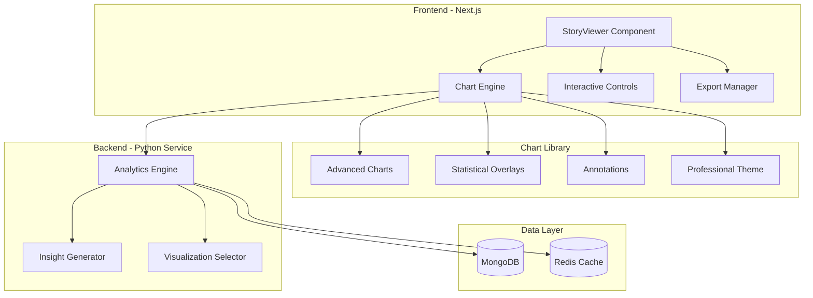

# Professional Data Visualization - Design Document

## Overview

This design transforms DataStory's visualization capabilities from basic charts into a professional-grade analytics platform. The system will feature advanced chart types, statistical overlays, interactive controls, and intelligent insight generation that matches enterprise analytics tools like Tableau, Power BI, and Looker.

The design follows a layered architecture:
1. **Statistical Analysis Layer** (Python backend) - Enhanced analytics engine
2. **Chart Engine Layer** (React/TypeScript) - Advanced visualization components
3. **Interaction Layer** - User controls and interactivity
4. **Export Layer** - High-quality output generation

## Architecture

### High-Level System Architecture



### Data Flow

1. **Analysis Phase** (Python Backend)
   - User uploads dataset → Preprocessing
   - Statistical analysis (trends, correlations, distributions, outliers)
   - Advanced metrics calculation (moving averages, seasonality, regression)
   - Insight generation with ranking
   - Visualization selection with scoring

2. **Rendering Phase** (Frontend)
   - Receive enriched chart data with statistical metadata
   - Initialize chart components with professional theme
   - Apply statistical overlays (trend lines, confidence intervals)
   - Render interactive controls
   - Set up event handlers for user interactions

3. **Interaction Phase**
   - User interactions (hover, click, zoom, pan)
   - Dynamic updates to chart state
   - Cross-chart highlighting and filtering
   - Real-time tooltip updates
   - State synchronization across components

4. **Export Phase**
   - Capture chart state
   - Generate high-resolution output
   - Apply export-specific styling
   - Package with metadata

## Components and Interfaces

### 1. Enhanced Chart Components

#### Base Chart Interface
```typescript
interface BaseChartProps {
  data: ChartData;
  title: string;
  config: ChartConfig;
  statistics?: StatisticalOverlay;
  interactions?: InteractionConfig;
  theme?: ThemeConfig;
  onDataPointClick?: (point: DataPoint) => void;
  onRangeSelect?: (range: DataRange) => void;
}

interface StatisticalOverlay {
  trendLine?: TrendLineConfig;
  movingAverage?: MovingAverageConfig;
  confidenceInterval?: ConfidenceIntervalConfig;
  outliers?: OutlierConfig;
  annotations?: Annotation[];
  referenceLines?: ReferenceLine[];
}

interface InteractionConfig {
  zoom: boolean;
  pan: boolean;
  brush: boolean;
  crosshair: boolean;
  tooltip: TooltipConfig;
  legend: LegendConfig;
}
```

#### New Advanced Chart Types

**1. Combination Chart**
- Supports multiple series with different chart types
- Dual Y-axes for different scales
- Synchronized interactions across series
```typescript
interface CombinationChartProps extends BaseChartProps {
  series: Array<{
    type: 'line' | 'bar' | 'area';
    dataKey: string;
    yAxisId: 'left' | 'right';
    color: string;
  }>;
}
```

**2. Heatmap**
- Color-coded matrix visualization
- Supports correlation matrices and time-based patterns
- Interactive cell selection
```typescript
interface HeatmapProps extends BaseChartProps {
  xLabels: string[];
  yLabels: string[];
  colorScale: ColorScale;
  cellSize?: number;
}
```

**3. Box Plot**
- Statistical distribution visualization
- Shows quartiles, median, outliers
- Supports grouped comparisons
```typescript
interface BoxPlotProps extends BaseChartProps {
  groups: string[];
  showOutliers: boolean;
  orientation: 'horizontal' | 'vertical';
}
```

**4. Waterfall Chart**
- Shows cumulative effect of values
- Supports positive/negative contributions
- Ideal for financial analysis
```typescript
interface WaterfallChartProps extends BaseChartProps {
  startValue: number;
  endValue: number;
  showConnectors: boolean;
}
```

**5. Funnel Chart**
- Visualizes progressive reduction
- Supports conversion rate annotations
- Customizable stage colors
```typescript
interface FunnelChartProps extends BaseChartProps {
  stages: Array<{
    name: string;
    value: number;
    color?: string;
  }>;
  showPercentages: boolean;
}
```

**6. Radar Chart**
- Multi-dimensional comparison
- Supports multiple series overlay
- Customizable axis ranges
```typescript
interface RadarChartProps extends BaseChartProps {
  dimensions: string[];
  series: Array<{
    name: string;
    values: number[];
    color: string;
  }>;
}
```

### 2. Statistical Analysis Engine (Python)

#### Enhanced Analyzer Classes

**Advanced Trend Detector**
```python
class AdvancedTrendDetector:
    def detect_trends(self, df, numeric_cols, datetime_cols):
        # Linear regression with confidence intervals
        # Polynomial trend detection
        # Seasonal decomposition
        # Change point detection
        # Moving averages (7, 30, 90 day)
        return {
            'linear_trends': [...],
            'seasonal_patterns': [...],
            'change_points': [...],
            'moving_averages': {...}
        }
```

**Correlation Analyzer with Significance Testing**
```python
class CorrelationAnalyzer:
    def analyze_correlations(self, df, numeric_cols):
        # Pearson correlation with p-values
        # Spearman rank correlation
        # Partial correlations
        # Correlation matrix for heatmap
        return {
            'correlations': [...],
            'correlation_matrix': [[...]],
            'significant_pairs': [...]
        }
```

**Distribution Analyzer with Advanced Metrics**
```python
class DistributionAnalyzer:
    def analyze_distributions(self, df, numeric_cols):
        # Quartiles for box plots
        # Histogram bins
        # Kernel density estimation
        # Normality tests
        # Outlier detection (IQR, Z-score, Isolation Forest)
        return {
            'distributions': [...],
            'outliers': [...],
            'normality_tests': [...]
        }
```

**Insight Generator with Ranking**
```python
class InsightGenerator:
    def generate_insights(self, analysis_results):
        # Identify top patterns
        # Rank by statistical significance
        # Generate natural language explanations
        # Create actionable recommendations
        return {
            'insights': [
                {
                    'type': 'trend' | 'correlation' | 'outlier' | 'distribution',
                    'title': str,
                    'description': str,
                    'significance': float,  # 0-1
                    'impact': 'high' | 'medium' | 'low',
                    'recommendation': str
                }
            ]
        }
```

### 3. Interactive Controls System

#### Zoom and Pan Controller
```typescript
class ZoomPanController {
  private zoomLevel: number = 1;
  private panOffset: { x: number; y: number } = { x: 0, y: 0 };
  
  handleZoom(delta: number, center: Point): void;
  handlePan(offset: Point): void;
  resetView(): void;
  fitToData(): void;
}
```

#### Brush Selection Tool
```typescript
interface BrushSelection {
  start: Point;
  end: Point;
  dataRange: { xMin: number; xMax: number; yMin: number; yMax: number };
}

class BrushController {
  onBrushStart(point: Point): void;
  onBrushMove(point: Point): void;
  onBrushEnd(): BrushSelection;
  clearBrush(): void;
}
```

#### Tooltip Manager
```typescript
interface TooltipData {
  title: string;
  metrics: Array<{ label: string; value: string; color?: string }>;
  statistics?: {
    percentOfTotal?: number;
    rank?: number;
    comparisonToAverage?: number;
  };
  customContent?: React.ReactNode;
}

class TooltipManager {
  show(data: TooltipData, position: Point): void;
  hide(): void;
  updatePosition(position: Point): void;
}
```

### 4. Professional Theme System

#### Color Palettes
```typescript
interface ColorPalette {
  categorical: string[];  // For distinct categories
  sequential: string[];   // For ordered data (light to dark)
  diverging: string[];    // For data with meaningful midpoint
  semantic: {
    positive: string;
    negative: string;
    neutral: string;
    warning: string;
  };
}

const professionalPalettes = {
  default: {
    categorical: ['#2563eb', '#10b981', '#f59e0b', '#ef4444', '#8b5cf6', '#ec4899'],
    sequential: ['#dbeafe', '#93c5fd', '#3b82f6', '#1e40af', '#1e3a8a'],
    diverging: ['#ef4444', '#f87171', '#fbbf24', '#34d399', '#10b981']
  },
  colorblindSafe: {
    categorical: ['#0173b2', '#de8f05', '#029e73', '#cc78bc', '#ca9161', '#949494'],
    // ... more palettes
  }
};
```

#### Typography System
```typescript
interface TypographyConfig {
  title: {
    fontSize: number;
    fontWeight: number;
    lineHeight: number;
    color: string;
  };
  axisLabel: {
    fontSize: number;
    fontWeight: number;
    color: string;
  };
  dataLabel: {
    fontSize: number;
    fontWeight: number;
    color: string;
  };
  tooltip: {
    fontSize: number;
    fontWeight: number;
    lineHeight: number;
  };
}
```

#### Visual Design Tokens
```typescript
interface DesignTokens {
  spacing: {
    chartPadding: number;
    labelMargin: number;
    legendSpacing: number;
  };
  borders: {
    gridLineWidth: number;
    gridLineColor: string;
    gridLineDash: number[];
  };
  animations: {
    duration: number;
    easing: string;
  };
  shadows: {
    tooltip: string;
    chart: string;
  };
}
```

### 5. Export System

#### Export Manager
```typescript
class ExportManager {
  exportToPNG(chart: ChartElement, options: PNGExportOptions): Promise<Blob>;
  exportToSVG(chart: ChartElement, options: SVGExportOptions): Promise<string>;
  exportToCSV(data: ChartData, options: CSVExportOptions): Promise<string>;
  exportToJSON(data: ChartData, metadata: ChartMetadata): Promise<string>;
  exportStoryToPDF(story: Story, options: PDFExportOptions): Promise<Blob>;
}

interface PNGExportOptions {
  width: number;
  height: number;
  dpi: number;  // 150-300
  backgroundColor: string;
  includeWatermark: boolean;
}

interface SVGExportOptions {
  width: number;
  height: number;
  embedFonts: boolean;
  includeCSS: boolean;
}
```

## Data Models

### Enhanced Story Model

```typescript
// Extend existing IChart interface
interface IChartEnhanced extends IChart {
  chartId: string;
  type: ChartType | AdvancedChartType;
  title: string;
  data: ChartData;
  config: IChartConfig;
  
  // New fields
  statistics?: {
    trendLine?: {
      slope: number;
      intercept: number;
      rSquared: number;
      confidenceInterval?: { lower: number[]; upper: number[] };
    };
    movingAverages?: {
      period: number;
      values: number[];
    }[];
    outliers?: {
      indices: number[];
      values: number[];
      method: 'iqr' | 'zscore' | 'isolation_forest';
    };
    annotations?: Annotation[];
  };
  
  interactions?: {
    zoomEnabled: boolean;
    panEnabled: boolean;
    brushEnabled: boolean;
    crosshairEnabled: boolean;
  };
  
  insights?: {
    primary: string;
    secondary?: string;
    significance: number;
  };
}

type AdvancedChartType = 
  | 'combination'
  | 'heatmap'
  | 'boxplot'
  | 'waterfall'
  | 'funnel'
  | 'radar'
  | 'area'
  | 'candlestick';

interface Annotation {
  type: 'text' | 'line' | 'region';
  position: { x: number | string; y: number | string };
  content: string;
  style?: {
    color?: string;
    fontSize?: number;
    backgroundColor?: string;
  };
}
```

### Enhanced Statistics Model

```typescript
interface IStatisticsEnhanced extends IStatistics {
  trends: ITrend[];
  correlations: ICorrelation[];
  distributions: IDistribution[];
  
  // New fields
  advancedTrends?: {
    seasonal?: {
      period: number;
      strength: number;
      pattern: number[];
    }[];
    changePoints?: {
      index: number;
      timestamp: string;
      significance: number;
    }[];
    movingAverages?: {
      column: string;
      periods: number[];
      values: { [period: number]: number[] };
    }[];
  };
  
  correlationMatrix?: {
    columns: string[];
    matrix: number[][];
    pValues?: number[][];
  };
  
  outlierAnalysis?: {
    column: string;
    method: string;
    outliers: {
      index: number;
      value: number;
      zScore?: number;
    }[];
  }[];
  
  insights?: {
    type: string;
    title: string;
    description: string;
    significance: number;
    impact: 'high' | 'medium' | 'low';
    recommendation: string;
    relatedChartId?: string;
  }[];
}
```

## Error Handling

### Chart Rendering Errors

```typescript
class ChartErrorBoundary extends React.Component {
  // Graceful degradation for chart failures
  // Show error message with data summary
  // Provide fallback to simpler chart type
  // Log errors for monitoring
}

interface ChartError {
  type: 'data' | 'rendering' | 'interaction' | 'export';
  message: string;
  chartId: string;
  fallbackAvailable: boolean;
}
```

### Data Validation

```typescript
class ChartDataValidator {
  validateData(data: ChartData, chartType: ChartType): ValidationResult;
  sanitizeData(data: ChartData): ChartData;
  handleMissingValues(data: ChartData, strategy: 'remove' | 'interpolate' | 'zero'): ChartData;
}

interface ValidationResult {
  isValid: boolean;
  errors: string[];
  warnings: string[];
  suggestions: string[];
}
```

### Performance Monitoring

```typescript
class ChartPerformanceMonitor {
  measureRenderTime(chartId: string): void;
  measureInteractionLatency(interaction: string): void;
  reportSlowCharts(threshold: number): ChartPerformanceReport[];
}

interface ChartPerformanceReport {
  chartId: string;
  renderTime: number;
  dataPoints: number;
  interactionLatency: number;
  recommendations: string[];
}
```

## Testing Strategy

### Unit Tests

1. **Chart Component Tests**
   - Render with various data shapes
   - Handle edge cases (empty data, single point, extreme values)
   - Verify statistical calculations
   - Test theme application
   - Validate accessibility

2. **Statistical Analysis Tests**
   - Verify trend detection accuracy
   - Test correlation calculations
   - Validate outlier detection
   - Check distribution statistics
   - Test insight generation logic

3. **Interaction Tests**
   - Zoom and pan functionality
   - Brush selection accuracy
   - Tooltip positioning
   - Cross-chart synchronization
   - Export functionality

### Integration Tests

1. **End-to-End Chart Generation**
   - Upload dataset → Analysis → Visualization → Rendering
   - Verify complete data flow
   - Test with various dataset types
   - Validate performance with large datasets

2. **Export Integration**
   - Generate and validate PNG exports
   - Generate and validate SVG exports
   - Generate and validate PDF exports
   - Verify data export formats

### Visual Regression Tests

1. **Chart Appearance**
   - Screenshot comparison for each chart type
   - Verify theme consistency
   - Check responsive behavior
   - Validate animation smoothness

### Performance Tests

1. **Rendering Performance**
   - Measure time to first render
   - Test with 1K, 10K, 100K data points
   - Verify frame rate during interactions
   - Check memory usage

2. **Statistical Analysis Performance**
   - Benchmark analysis algorithms
   - Test with large datasets
   - Verify caching effectiveness

## Implementation Phases

### Phase 1: Foundation (Weeks 1-2)
- Set up advanced chart library (Recharts + custom components)
- Implement professional theme system
- Create base chart components with new interfaces
- Enhance Python statistical analysis engine

### Phase 2: Advanced Charts (Weeks 3-4)
- Implement combination charts
- Implement heatmaps
- Implement box plots
- Implement waterfall charts
- Implement funnel charts
- Implement radar charts

### Phase 3: Statistical Overlays (Week 5)
- Add trend lines with confidence intervals
- Add moving averages
- Add outlier highlighting
- Add reference lines and annotations
- Implement correlation matrix visualization

### Phase 4: Interactivity (Week 6)
- Implement zoom and pan controls
- Add brush selection
- Enhance tooltip system
- Add cross-chart highlighting
- Implement legend interactions

### Phase 5: Insights & Intelligence (Week 7)
- Enhance insight generation algorithm
- Add insight ranking system
- Create insight display components
- Implement recommendation engine

### Phase 6: Export & Polish (Week 8)
- Implement high-quality export system
- Add responsive design improvements
- Performance optimization
- Accessibility improvements
- Final testing and bug fixes

## Technical Considerations

### Library Selection

**Charting Library**: Recharts (current) + Custom Extensions
- Pros: React-native, good performance, extensible
- Cons: Limited advanced chart types (need custom implementation)
- Alternative: Consider Visx for more control, or hybrid approach

**Statistical Computing**: Python (scipy, numpy, pandas, scikit-learn)
- Already in use, excellent for statistical analysis
- Add: statsmodels for advanced time series analysis

**Export**: html2canvas + jsPDF (current) + Custom SVG export
- Enhance with higher DPI support
- Add direct SVG export capability

### Performance Optimization

1. **Data Sampling**: For datasets > 5000 points, implement intelligent sampling
2. **Virtualization**: Use canvas rendering for dense scatter plots
3. **Memoization**: Cache statistical calculations
4. **Lazy Loading**: Load charts as they enter viewport
5. **Web Workers**: Offload heavy calculations to background threads

### Accessibility

1. **Keyboard Navigation**: Full keyboard support for all interactions
2. **Screen Readers**: ARIA labels and descriptions for all charts
3. **Color Contrast**: WCAG AA compliance for all text and data elements
4. **Alternative Text**: Provide text summaries of visual insights
5. **Focus Management**: Clear focus indicators for interactive elements

### Browser Compatibility

- Target: Modern browsers (Chrome, Firefox, Safari, Edge)
- Minimum: ES2020 support
- Fallbacks: Provide simpler charts for older browsers
- Testing: Cross-browser testing for all chart types

## Success Metrics

1. **Visual Quality**: Charts match professional analytics tools in appearance
2. **Performance**: Render time < 500ms for typical datasets
3. **Insight Quality**: Users discover 3+ actionable insights per dataset
4. **User Engagement**: Increased time spent exploring visualizations
5. **Export Usage**: 40%+ of users export charts or stories
6. **Mobile Usage**: Smooth experience on mobile devices (60 FPS)
